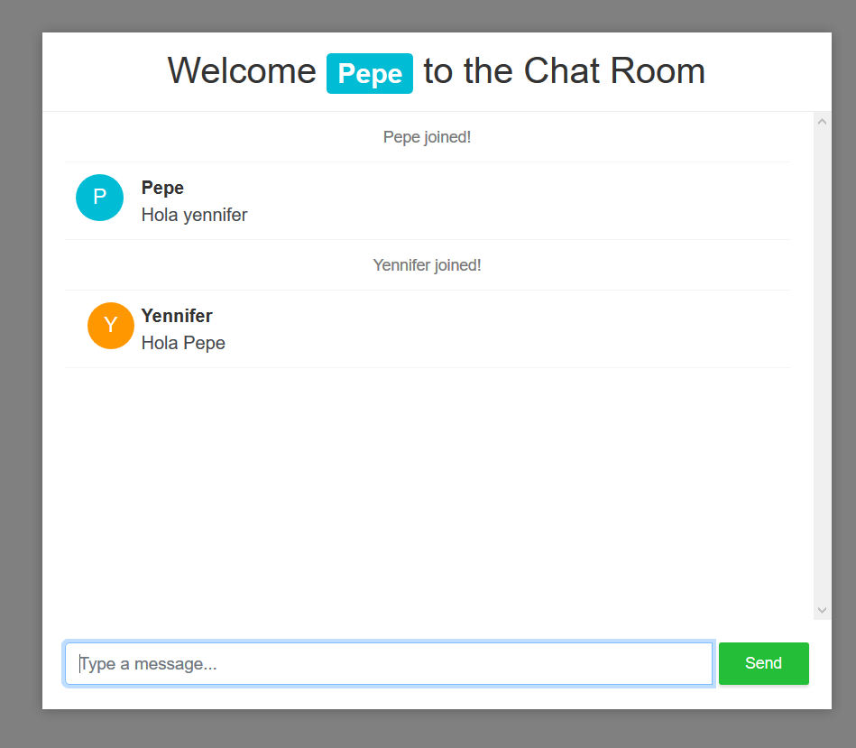

# Spring-Boot-WebSocket
Building a chat room application using Spring Boot and Websockets and Stomp protocol

To run the app go to : //localhost:8080

Dependencies:
<dependencies>
		<dependency>
			<groupId>org.springframework.boot</groupId>
			<artifactId>spring-boot-starter-websocket</artifactId>
		</dependency>
		<dependency>
			<groupId>org.webjars</groupId>
			<artifactId>webjars-locator-core</artifactId>
		</dependency>
		<dependency>
			<groupId>org.webjars</groupId>
			<artifactId>bootstrap</artifactId>
			<version>4.0.0</version>
		</dependency>
		<dependency>
			<groupId>org.webjars</groupId>
			<artifactId>sockjs-client</artifactId>
			<version>1.0.2</version>
		</dependency>
		<dependency>
			<groupId>org.webjars</groupId>
			<artifactId>stomp-websocket</artifactId>
			<version>2.3.3</version>
		</dependency>
		<dependency>
			<groupId>org.springframework.boot</groupId>
			<artifactId>spring-boot-starter-reactor-netty</artifactId>
		</dependency>
		<dependency>
			<groupId>org.springframework.boot</groupId>
			<artifactId>spring-boot-starter-test</artifactId>
			<scope>test</scope>
		</dependency>
	</dependencies>
